# map-motion · 地图动效视频 Skill

给 Claude Code 用的地图动画 skill：用一句话描述（或一份 JSON 镜头表），出一段**基于真实高德地图数据**的地图动效视频——竖屏/横屏 MP4，外加 GIF。

> 路线是高德真实的驾车/步行/骑行路线，边界是真实的行政区和公园轮廓，海拔是 SRTM 卫星高程，底图可以直接用高德标准地图或卫星图。

<p>
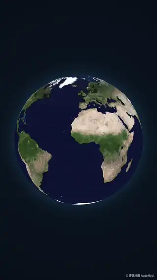
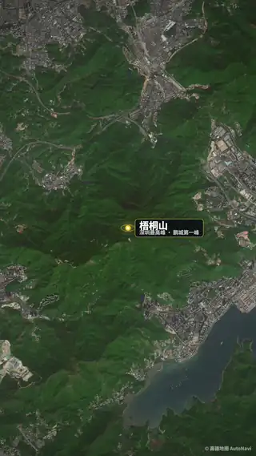
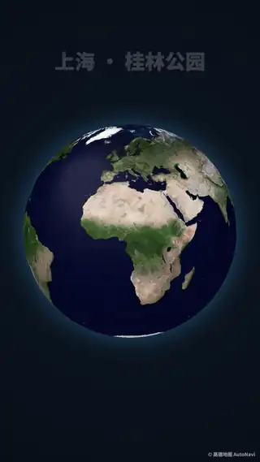
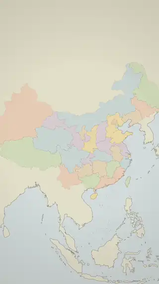
</p>

## 能做哪些视频

### 1. Vlog 片头「我在这里」
卫星地球俯冲 → 瞄准镜收缩锁定（LOCKED）→ 坐标卡：地名逐字打出、经纬度滚动到位、海拔、拍摄时间。10 秒，直接接你的 vlog 正片。

 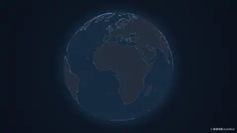

`assets/examples/vlog_locate.json` · `vlog_locate_night.json`

### 2. 徒步登山：路线 + 海拔剖面
镜头跟着人沿高德步行路线上山，底部的海拔曲线同步画出，实时显示海拔和累计爬升，山顶插旗。


深圳梧桐山，泰山涧 → 大梧桐：3.6 km，海拔 98 → 916 m，累计爬升 835 m。`hike_elevation.json`

### 3. 长途骑行 / 自驾：多站旅程
一次写完整趟行程：逐段路线、累计里程表、「DAY n · 日期 · km」、到站邮戳、照片拍立得、原路返程。

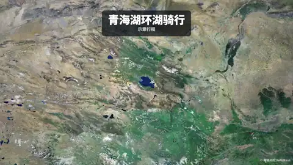 

青海湖环湖骑行（高德骑行路线 365 km，海拔 3,200 m 上下）· 国庆自驾深圳 → 香格里拉往返 4,213 km。`cycling_trip.json` · `road_trip.json`

### 4. 介绍一个地方：公园、景区、校园
从地球或行政区推进到一个地块，描出轮廓、填色，再从地铁站步行过去、绕园一周。

 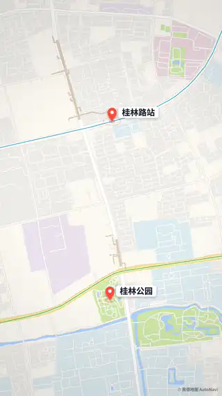

上海徐汇区桂林公园。`park_locate.json` · `park_walk.json`

### 5. 航线、行政区、业务分布
城市间飞线（大圆航线，飞机沿弧飞）、行政区依次描边高亮、一个中心向多城辐射。

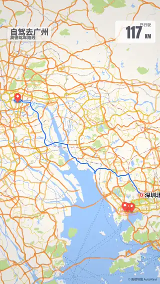 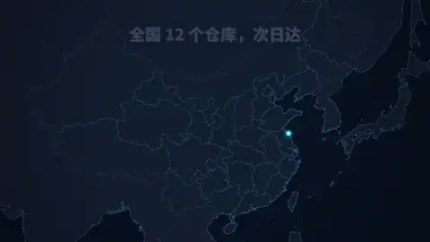

`showcase.json` · `flight.json` · `region.json` · `radiate.json`

### 6. 找机位：照片从地图上「咔嚓」翻出来（子 skill `photo-spot`）
给一张照片：卫星地球俯冲 → 相机图标落在拍照机位、被摄地落针 → 取景扇形扫过去 → 取景框对焦 → 快门声＋闪白 → 照片从机位处 3D 翻折立起，背景是照片自身的虚化；可加 iPhone Live Photo 播放效果（用真 MOV，或静态照片模拟）。照片带 GPS 时自动读出机位、朝向、焦距和参数。

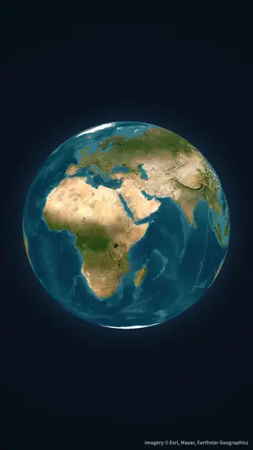  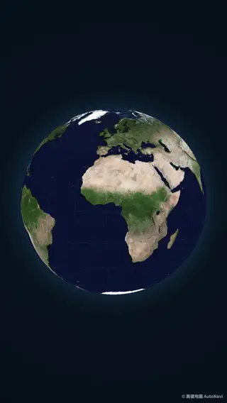

富士山 × 新干线（境外，Esri 卫星）· 雨崩神瀑 → 卡瓦格博（Live Photo 模拟）· 香港钓鱼翁 → 布袋澳。`photo-spot/`（安装见下）· 示例 spec 在 `photo-spot/examples/`

## 13 种风格

同一份镜头表，改一个 `style` 字段就换风格。前 5 种直接用高德瓦片、`satellite-world` 用 Esri 卫星（能推到街道级），后 7 种用代码绘制矢量底图（全国到地级市尺度）。

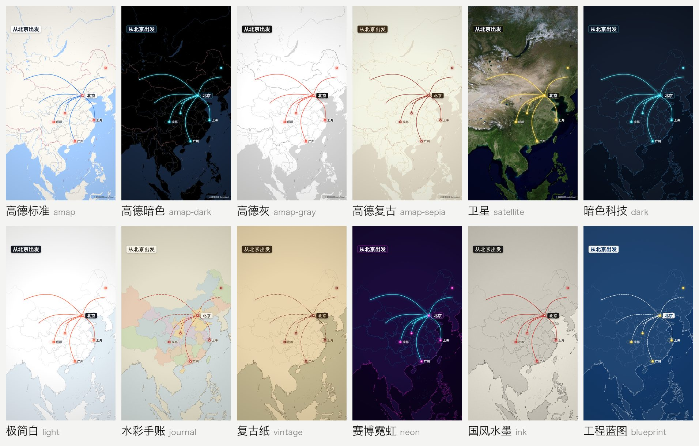
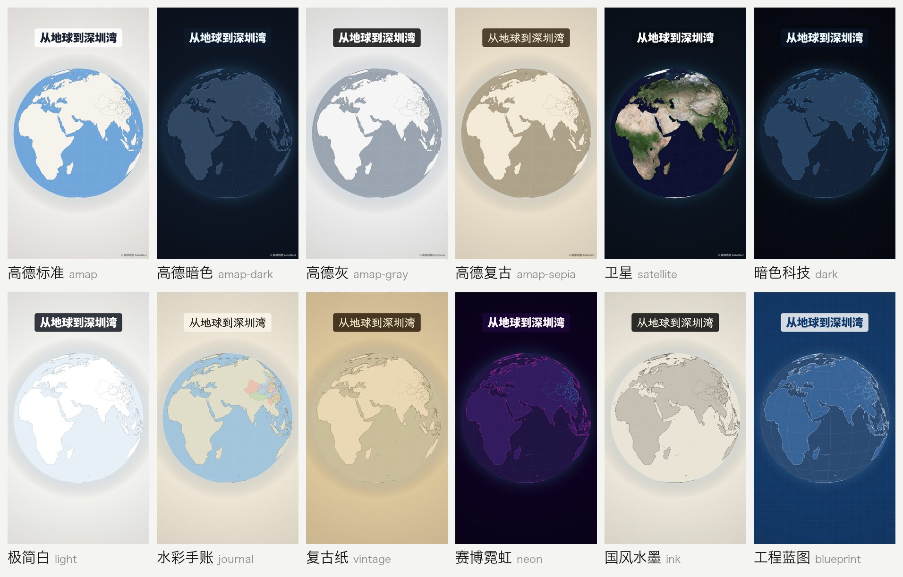

| style | 名字 | 适合 |
|---|---|---|
| `amap` | 高德标准 | 通用、街道级路线 |
| `amap-dark` | 高德暗色 | 夜景、科技感 |
| `amap-gray` | 高德灰 | 数据可视化、新闻图解 |
| `amap-sepia` | 高德复古 | 怀旧、城市故事 |
| `satellite` | 卫星（地球也是真实卫星图） | 片头俯冲、户外、登山 |
| `satellite-world` | Esri 全球卫星 | **境外地点**（高德卫星境外推近无影像） |
| `dark` | 暗色科技 | 业务分布、数据大屏 |
| `light` | 极简白 | 区域介绍、信息图 |
| `journal` | 水彩手账 | 旅行复盘 |
| `vintage` | 复古纸 | 历史、怀旧 |
| `neon` | 赛博霓虹 | 潮流、音乐、夜生活 |
| `ink` | 国风水墨 | 文旅、历史路线 |
| `blueprint` | 工程蓝图 | 规划、工程、科普 |

## 13 种镜头

| type | 效果 |
|---|---|
| `globe` | 地球自转 → 俯冲到一个地点 |
| `locate` | 地球俯冲 → 瞄准镜锁定 → 坐标卡（vlog 片头） |
| `pins` | 一串地点依次落针、带涟漪 |
| `route` | 高德驾车/步行/骑行路线或自己的 GPX 描线；车/人沿线走、镜头跟随、里程表、海拔剖面、终点插旗 |
| `flight` | 大圆航线，飞机沿拱起的弧线飞 |
| `region` | 行政区（省/市/区县）描边 → 填色 → 写名 |
| `area` | 公园/景区/校园等地块轮廓（OpenStreetMap），可绕行一圈 |
| `radiate` | 一个中心向多点放射飞线 |
| `trip` | 多站旅程：逐段路线、累计里程、邮戳、照片、返程 |
| `overview` | 拉回全景，框住所有出现过的地点 |
| `title` | 标题卡 |
| `snap` | 机位揭秘：相机图标＋取景扇形 → 对焦 → 咔嚓 → 照片 3D 翻折立起，可选 Live Photo（`photo-spot` 用的就是它） |
| `guess` | 「这张照片在哪拍的？」：整屏照片＋提示＋倒数，再接 `locate` 揭晓 |

镜头之间自动「飞过去」：远距离先拉远再推近，和 Mapbox `flyTo` 同一套公式，不用手写转场。完整参数见 [references/spec.md](references/spec.md)。

## 快速开始

**1. 安装**

```sh
git clone https://github.com/SpaceZephyr/map-motion ~/.claude/skills/map-motion
uv run --with playwright playwright install chromium     # 首次：无头浏览器
```
依赖：[uv](https://docs.astral.sh/uv/)、ffmpeg。

要用「找机位」子 skill，再链接一下（它复用 map-motion 的渲染引擎）：
```sh
ln -s ~/.claude/skills/map-motion/photo-spot ~/.claude/skills/photo-spot
```

**2. 配高德 key**（高德开放平台 → 应用管理 → 添加「Web服务」类型 key，免费）

```sh
mkdir -p ~/.config/map-motion && echo '你的key' > ~/.config/map-motion/amap_key && chmod 600 ~/.config/map-motion/amap_key
```

**3. 用**

在 Claude Code 里直接说：

> 帮我做一个 vlog 片头，我在大理双廊，10 月 3 号早上 7 点 42

> 把我这次爬梧桐山的路线做成带海拔的动画

> 做一个从杭州辐射到全国 12 个城市的地图动画，暗色风格

或者自己写镜头表：

```json
{"size": "portrait", "style": "satellite",
 "shots": [
  {"type": "locate", "to": "双廊古镇", "zoom": 15.6, "name": "大理 · 双廊", "sub": "洱海东岸 · DAY 3", "date": "2026.10.03  07:42"}
 ]}
```

```sh
~/.claude/skills/map-motion/scripts/make.sh 片头.json 片头.mp4 --gif 片头.gif
~/.claude/skills/map-motion/scripts/make.sh 片头.json 静帧/ --stills 2,6,9      # 先抽几帧看构图
```

编译时会打印每个地点被高德解析成了什么，**请逐行核对**——同名地点会解析错（实测过「香格里拉」→ 某家酒店、「青海湖」→ 乌鲁木齐一个同名小区）。

## 怎么做出来的

```
镜头表 spec.json
   │  compile.py  ── 高德：地名→坐标、驾车/步行/骑行路线、行政区边界
   │              ── OpenStreetMap：公园/景区轮廓    OpenTopoData：SRTM 海拔
   │              ── 算每个镜头的取景、镜头之间的飞行、图层出现/消失时间
   ▼
timeline.json
   │  render.py   ── 本地服务（运行时 + 高德瓦片代理缓存）→ 无头 Chromium 逐帧画 → ffmpeg
   ▼
成片.mp4 / .gif
```

- **地球**：正射投影逐像素反投影取纹理（卫星样式的纹理就是高德卫星瓦片拼出来的），缩放到 3–3.6 级时和平面地图交叉淡化，所以能从太空一路推到街道。
- **平面**：Web 墨卡托，512px 高清瓦片；矢量底图用多边形裁剪防止推近时破面。
- **坐标**：全程 GCJ-02（高德坐标），GPS/照片/GPX/OSM 的 WGS-84 坐标自动转换；查海拔时再转回 WGS-84。
- **确定性**：同一份时间轴两次渲染逐帧一致；瓦片、API、海拔全部本地缓存，改了重渲不再消耗配额。

## 参考了哪些 skill 和方法

**Skill**
- [huashu-art-motion](https://github.com/alchaincyf/huashu-art-motion)（花叔）：借鉴了它的工作方法——风格先在同一帧上出多个方向让人挑、所有渲染确定性可复现、交付前抽静帧逐帧检查、派独立 agent 只看成片审片、把踩过的坑写回 skill（本 skill 的 SKILL.md 末尾也保留了「踩过的坑」）。
- [Anthropic skill-creator](https://github.com/anthropics/skills)：skill 的组织方式——SKILL.md 只放流程和选择指南，参数细节放 references/，可执行部分放 scripts/，按需加载。

**产品与灵感**
- [Mult.dev](https://mult.dev)、[TravelAnimator](https://travelanimator.com)：旅行地图视频的常见镜头（航线、自驾、照片插入）。
- Google Earth Studio：从地球俯冲到地点的片头语言。
- Mapbox `flyTo`：镜头飞行的手感。

**算法**
- van Wijk & Nuij, *Smooth and efficient zooming and panning*（2003）：镜头先拉远再推近的最优路径。
- 正射投影与逐像素反投影；大圆插值（球面线性插值）画航线。
- Douglas–Peucker 折线抽稀；Sutherland–Hodgman 多边形裁剪。
- WGS-84 ↔ GCJ-02 坐标转换。

**数据**
- [高德开放平台](https://lbs.amap.com) Web 服务 API（地理编码、路径规划、行政区）与地图瓦片
- [阿里云 DataV GeoAtlas](https://datav.aliyun.com/portal/school/atlas/area_selector)：中国省级边界（含南海诸岛与九段线）
- [Natural Earth](https://www.naturalearthdata.com) / [world-atlas](https://github.com/topojson/world-atlas)：世界陆地轮廓
- [OpenStreetMap](https://www.openstreetmap.org)（Overpass API）：公园、景区等地块轮廓 © OpenStreetMap contributors，ODbL
- [OpenTopoData](https://www.opentopodata.org)：SRTM 30m 海拔
- [Esri World Imagery](https://www.arcgis.com/home/item.html?id=10df2279f9684e4a9f6a7f08febac2a9)：境外卫星影像（`satellite-world`），© Esri, Maxar, Earthstar Geographics

## 使用边界

- **高德瓦片**：渲染时直接取高德瓦片，属于非官方用法。个人视频、学习交流可用，成片右下角保留「© 高德地图」署名；**商业投放需要高德的商业授权**，或改用 7 种矢量风格。`satellite-world` 的 Esri 影像同理：个人非商业可用并保留署名，商用需 Esri 授权。
- **地图合规**：中国边界按内置数据绘制（含台湾、南海诸岛与九段线），请勿删改；对外商用的地图内容在国内受《地图管理条例》约束。
- **海拔**：SRTM 是约 30 米网格的平均高程，山顶会比实际略低（梧桐山顶实测 944 m，SRTM 916 m）。
- **公园轮廓**：来自 OSM 志愿者绘制，精度不一，有的只有几个点。
- **示例里的日期**（青海湖骑行、vlog 拍摄时间）是示意，路线、里程、海拔是真实数据。

## License

代码 MIT。字体（思源黑体、霞鹜文楷、Anton）为 SIL OFL 1.1，见 `assets/fonts/`。地图数据遵循各自来源的条款（见上）。
